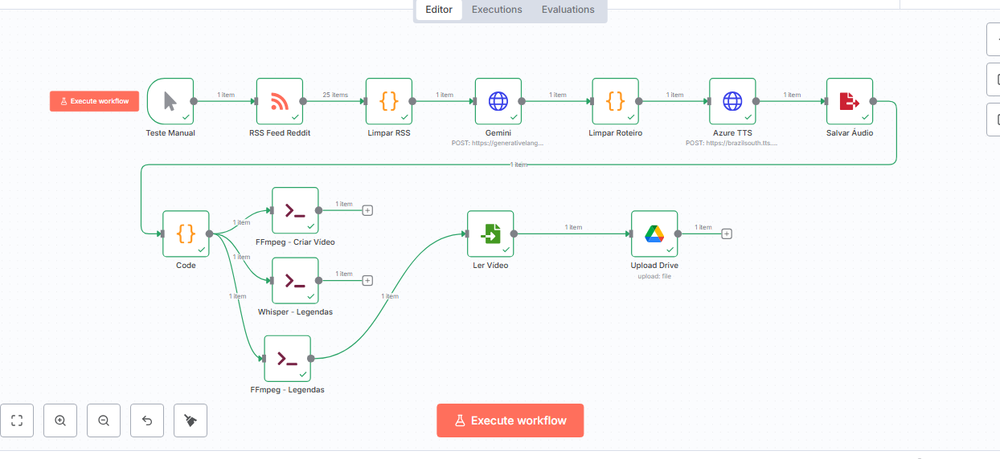
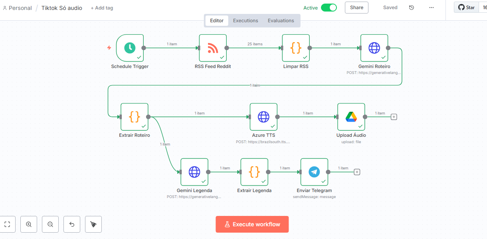
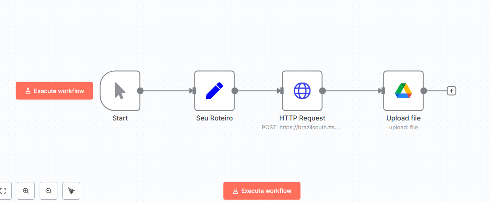

# 🎬 AI Content Automation Suite

> **Status:** Em Produção 🟢
> **Stack:** n8n, Google Gemini 1.5, Azure Speech Services, Docker.

Este repositório contém uma coleção de pipelines de automação *low-code* desenvolvidos para orquestração de mídia sintética. O sistema elimina gargalos operacionais na produção de conteúdo audiovisual, utilizando Agentes de IA para roteirização e ferramentas de cloud para síntese de voz.

---

## 🗂️ Arquitetura dos Fluxos

### 1. Full-Stack Video Pipeline (End-to-End)
O módulo principal da suíte. Realiza a produção completa de vídeo sem intervenção humana.
* **Trigger:** Monitoramento de RSS para identificar tendências em redes sociais.
* **Processamento:** Limpeza de dados -> Geração de Roteiro (Gemini) -> Síntese de Voz (Azure TTS).
* **Renderização:** Orquestração do **FFmpeg** via linha de comando para montagem de vídeo e *burn-in* de legendas automáticas (Whisper).

---

### 2. Audio & Subtitle Service (Telegram Bot)
Micro-serviço focado em agilidade para criadores. Recebe um tema ou link e devolve os assets brutos.
* **Output:** Entrega arquivos de áudio (.mp3) e legendas (.srt) sincronizados diretamente via API do Telegram.

---

### 3. TTS Microservice (Ferramenta de Apoio)
Fluxo utilitário para conversão rápida de textos manuais em áudio de alta fidelidade para testes A/B ou correções pontuais.
* **Integração:** Conecta input manual -> Azure Cognitive Services -> Google Drive.

---

## 🛠️ Tecnologias Utilizadas
* **Orquestrador:** n8n (Self-Hosted em Docker).
* **LLM (Inteligência):** Google Gemini 1.5 Flash.
* **Voz (TTS):** Microsoft Azure Cognitive Services.
* **Processamento de Mídia:** FFmpeg & OpenAI Whisper.
* **Cloud Storage:** Google Drive API.

---
*Projeto desenvolvido por [Wesley Saraiva](https://github.com/weessaraiva) para fins de estudo em Engenharia de Prompt e Automação de Processos.*
